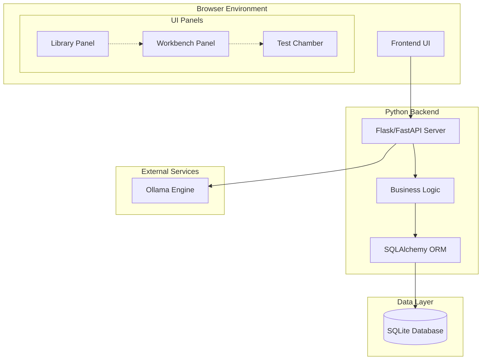

# PromptLab Design Document

## Overview

PromptLab is a local-first prompt engineering environment that combines a JavaScript frontend with a Python backend and SQLite database. The system provides an IDE-like interface for creating, refining, testing, and managing AI prompts using a local Ollama instance.

The architecture follows a three-tier pattern: a responsive web frontend for user interaction, a Python REST API backend for business logic and data management, and SQLite for persistent storage. The system integrates with Ollama for AI-powered prompt refinement and testing.

## Architecture

### System Architecture Diagram



### Technology Stack

**Frontend:**
- HTML5, CSS3, JavaScript (ES6+)
- Monaco Editor for code editing with syntax highlighting
- Fetch API for HTTP communication
- CSS Grid/Flexbox for responsive layout

**Backend:**
- Python 3.8+
- Flask or FastAPI for REST API
- SQLAlchemy for ORM and database management
- PyYAML for configuration export
- Requests library for Ollama communication

**Database:**
- SQLite for local data persistence
- Single file database (promptlab.db)

**External Integration:**
- Ollama REST API for AI model interaction

## Components and Interfaces

### Frontend Components

#### 1. Application Shell
- **Purpose**: Main container and layout management
- **Responsibilities**: 
  - Initialize three-panel layout
  - Handle responsive design breakpoints
  - Manage global application state
  - Coordinate inter-panel communication

#### 2. Library Panel Component
- **Purpose**: Prompt library management interface
- **Key Elements**:
  - Search bar with real-time filtering
  - Prompt list with name, description preview
  - Action buttons (New, Load, Delete)
  - Import/Export controls
- **State Management**: Maintains filtered prompt list and selection state

#### 3. Workbench Panel Component  
- **Purpose**: Prompt creation and editing workspace
- **Key Elements**:
  - Objective textarea for initial ideas
  - Refine button with loading states
  - Monaco Editor for system prompt editing
  - Save/Save As buttons with dirty state detection
- **Integration**: Communicates with both Library Panel and Test Chamber

#### 4. Test Chamber Component
- **Purpose**: Prompt testing and validation interface
- **Key Elements**:
  - Test message input field
  - Parameter controls (temperature slider, model dropdown)
  - Run Test button with async feedback
  - Response output area
  - YAML configuration display
- **Real-time Features**: Live parameter adjustment and immediate feedback

#### 5. Configuration Modal
- **Purpose**: System settings and Ollama connection management
- **Features**:
  - Ollama endpoint URL configuration
  - Connection status indicator
  - Model list refresh capability

### Backend Components

#### 1. API Router
- **Framework**: Flask with Blueprint organization or FastAPI with routers
- **Endpoints**:
  ```
  GET    /api/prompts           # List all prompts
  POST   /api/prompts           # Create new prompt
  PUT    /api/prompts/{id}      # Update existing prompt
  DELETE /api/prompts/{id}      # Delete prompt
  POST   /api/refine-prompt     # AI-assisted prompt refinement
  POST   /api/run-test          # Execute prompt test
  GET    /api/models            # Get available Ollama models
  POST   /api/export-library    # Export all prompts
  POST   /api/import-library    # Import prompt collection
  GET    /api/health            # System health check
  ```

#### 2. Prompt Service
- **Purpose**: Business logic for prompt operations
- **Methods**:
  - `create_prompt(name, description, system_prompt, model, temperature)`
  - `update_prompt(id, **kwargs)`
  - `delete_prompt(id)`
  - `search_prompts(query)`
  - `export_library()` → JSON/YAML format
  - `import_library(data)` → conflict resolution

#### 3. Ollama Integration Service
- **Purpose**: Communication with local Ollama instance
- **Methods**:
  - `refine_prompt(objective)` → enhanced system prompt
  - `test_prompt(system_prompt, user_input, model, temperature)` → AI response
  - `get_available_models()` → model list
  - `check_connection()` → health status
- **Error Handling**: Timeout management, connection retry logic

#### 4. Configuration Manager
- **Purpose**: Application settings and environment management
- **Features**:
  - Ollama endpoint configuration
  - Default model and parameter settings
  - Database connection management

## Data Models

### Prompt Entity (SQLAlchemy Model)

```python
class Prompt(db.Model):
    __tablename__ = 'prompts'
    
    id = db.Column(db.Integer, primary_key=True)
    name = db.Column(db.String(255), unique=True, nullable=False)
    description = db.Column(db.Text, nullable=True)
    system_prompt = db.Column(db.Text, nullable=False)
    model = db.Column(db.String(100), nullable=False, default='llama2')
    temperature = db.Column(db.Float, nullable=False, default=0.7)
    created_at = db.Column(db.DateTime, default=datetime.utcnow)
    updated_at = db.Column(db.DateTime, default=datetime.utcnow, onupdate=datetime.utcnow)
    
    def to_dict(self):
        return {
            'id': self.id,
            'name': self.name,
            'description': self.description,
            'system_prompt': self.system_prompt,
            'model': self.model,
            'temperature': self.temperature,
            'created_at': self.created_at.isoformat(),
            'updated_at': self.updated_at.isoformat()
        }
```

### Configuration Schema

```python
@dataclass
class AppConfig:
    ollama_endpoint: str = "http://localhost:11434"
    default_model: str = "llama2"
    default_temperature: float = 0.7
    database_path: str = "promptlab.db"
    
    @classmethod
    def from_file(cls, config_path: str) -> 'AppConfig':
        # Load from JSON/YAML configuration file
        pass
```

### API Request/Response Models

```python
# Request Models
class PromptCreateRequest(BaseModel):
    name: str
    description: Optional[str] = None
    system_prompt: str
    model: str = "llama2"
    temperature: float = 0.7

class RefinePromptRequest(BaseModel):
    objective: str
    target_model: str = "llama2"

class TestPromptRequest(BaseModel):
    system_prompt: str
    user_input: str
    model: str = "llama2"
    temperature: float = 0.7

# Response Models
class PromptResponse(BaseModel):
    id: int
    name: str
    description: Optional[str]
    system_prompt: str
    model: str
    temperature: float
    created_at: str
    updated_at: str

class TestResponse(BaseModel):
    response: str
    yaml_config: str
    execution_time: float
```

## Error Handling

### Frontend Error Management
- **Network Errors**: Display user-friendly messages for API failures
- **Validation Errors**: Real-time form validation with inline feedback
- **State Errors**: Graceful handling of dirty state conflicts
- **Loading States**: Clear visual feedback during async operations

### Backend Error Handling
- **Database Errors**: Transaction rollback and error logging
- **Ollama Communication**: Timeout handling and retry mechanisms
- **Validation Errors**: Structured error responses with field-level details
- **Resource Conflicts**: Proper HTTP status codes and conflict resolution

### Error Response Format
```json
{
    "error": true,
    "message": "Human-readable error description",
    "code": "ERROR_CODE",
    "details": {
        "field": "Specific field error message"
    }
}
```

## Testing Strategy

### Frontend Testing
- **Unit Tests**: Component logic and utility functions
- **Integration Tests**: API communication and data flow
- **E2E Tests**: Complete user workflows using browser automation
- **Accessibility Tests**: WCAG compliance validation

### Backend Testing
- **Unit Tests**: Service layer methods and business logic
- **Integration Tests**: Database operations and Ollama communication
- **API Tests**: Endpoint functionality and error handling
- **Performance Tests**: Response times and concurrent request handling

### Test Data Management
- **Fixtures**: Predefined prompt data for consistent testing
- **Mock Services**: Ollama API mocking for isolated testing
- **Database Seeding**: Automated test data setup and teardown

## Security Considerations

### Input Validation
- **SQL Injection Prevention**: Parameterized queries through SQLAlchemy
- **XSS Protection**: Input sanitization and output encoding
- **File Upload Security**: Validation for import functionality

### Local Security
- **Database Access**: File-based permissions for SQLite
- **API Security**: CORS configuration for local development
- **Configuration Security**: Secure storage of sensitive settings

## Performance Optimization

### Frontend Performance
- **Code Splitting**: Lazy loading of Monaco Editor
- **Caching**: Browser caching for static assets
- **Debouncing**: Search input optimization
- **Virtual Scrolling**: Large prompt list handling

### Backend Performance
- **Database Indexing**: Optimized queries for search functionality
- **Connection Pooling**: Efficient database connection management
- **Caching**: In-memory caching for frequently accessed data
- **Async Operations**: Non-blocking Ollama communication

## Deployment and Startup

### Single-Command Startup
```bash
# Development startup script
python run.py
```

The startup script will:
1. Initialize SQLite database if not exists
2. Start Flask/FastAPI backend server
3. Serve static frontend files
4. Automatically open browser to application URL
5. Display startup status and connection information

### Directory Structure
```
promptlab/
├── backend/
│   ├── app.py              # Main application entry
│   ├── models/             # SQLAlchemy models
│   ├── services/           # Business logic
│   ├── api/                # API endpoints
│   └── config.py           # Configuration management
├── frontend/
│   ├── index.html          # Main application page
│   ├── css/                # Stylesheets
│   ├── js/                 # JavaScript modules
│   └── assets/             # Static resources
├── run.py                  # Startup script
├── requirements.txt        # Python dependencies
└── README.md              # Setup instructions
```

This design provides a solid foundation for implementing PromptLab as a professional, user-friendly prompt engineering environment that meets all the specified requirements while maintaining clean architecture and extensibility.